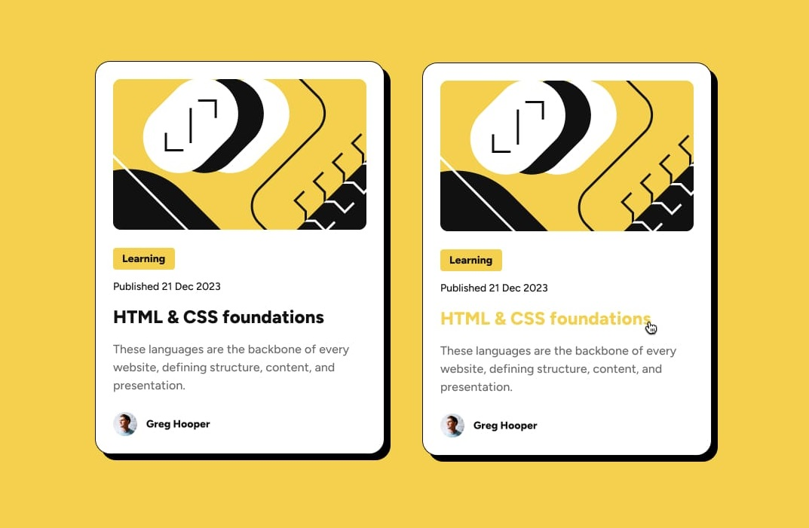
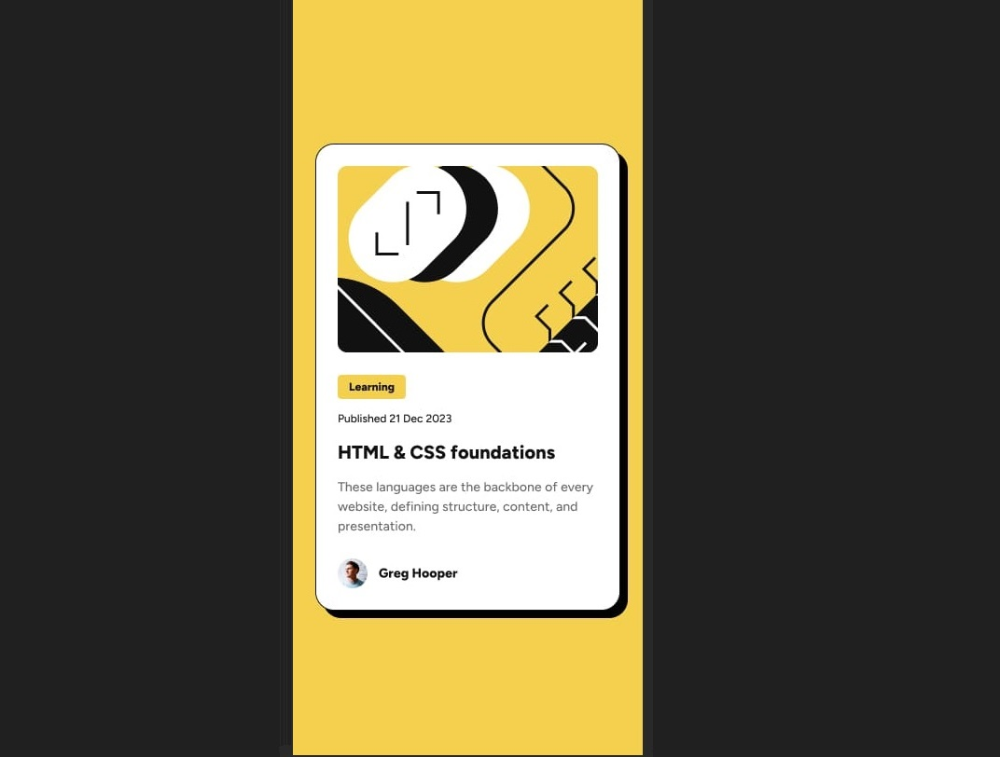

# Blog-preview_Card
## Live URL
- [https://divforscript.github.io/Blog-preview_Card/](https://divforscript.github.io/Blog-preview_Card/)
- 
This is a solution to the [Blog preview card challenge on Frontend Mentor](https://www.frontendmentor.io/challenges/blog-preview-card-ckPaj01IcS).

## Table of contents

- [Overview](#overview)
  - [The challenge](#the-challenge)
  - [Screenshot](#screenshot)
- [Implementarion](#implementation)
  - [What I learned](#what-i-learned)
  - [Useful resources](#useful-resources)
- [Author](#author)

## Overview

### The challenge

Users should be able to:

- See hover and focus states for all interactive elements on the page

### Screenshot
Desktop Design: 1440 px  
On this time, the model includes hover feature in the header of blog-card information. 

Mobile design: 375 px

## Implementation

### What I learned
I learned more about responsive design, hover and new features for CSS like `shadow` and `object-fit`

### Useful resources:
- https://developer.mozilla.org/en-US/docs/Web/CSS/box-shadow
- https://developer.mozilla.org/en-US/docs/Web/CSS/object-fit
- https://www.w3schools.com/css/css_text_spacing.asp
- https://stackoverflow.com/questions/3087975/how-to-change-the-cursor-into-a-hand-when-a-user-hovers-over-a-list-item

## Author
- Dayvid Ramos
